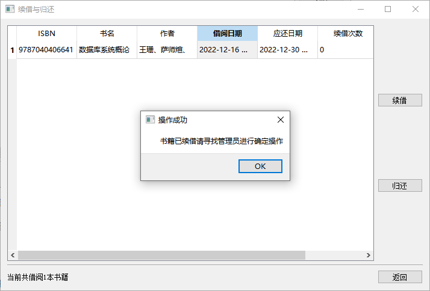

# 数据库实验大作业
[](https://wakatime.com/badge/user/aead9299-620d-4d9e-a115-cf8aa5ad290f/project/5035075f-0fb8-40f2-bc57-dc0126905c0e)

## 创建环境与运行程序

```bash
# 创建数据库并导入数据
> mysql
mysql> create DATABASE `sql-work`;
mysql> exit
> mysql -h localhost -u root -p sql-work < .\sql-work.sql

# 创建python环境
conda create -n sql-work python=3.8.1 # python版本请在3.8.1之上，否则可能会出现异常错误
conda activate sql-work
pip install pymysql pyside2 # 主要是安装这两个包

# 运行
python.\main.py # 运行时请确保此时在sql-wor目录下，否则无法读取UI进而导致无法运行
```

## 操作方法

执行命令后首先会看到一个选择是学生还是管理员登录的界面，分别对应学生与管理员的相关功能。


首先进入学生登录入口，然后输入测试用学生号`2020302888`与密码`123456`，点击登录后进入学生操作界面。


在学生操作界面可以查看学生当前基本信息与剩余可借阅书籍数。并在下面两个按钮分别进入查询与借阅书籍，续借与归还书籍功能界面。首先来看查询与借阅功能。


在当前页面下可在上方输入想要搜索的书籍名，然后点击右边搜索按钮，便会显示相关图书信息。之后选中想要借阅的书籍所在行的任意一个单元格，点击右侧借阅按钮即可发送借阅请求。之后可进入管理员界面进行申请确定。


再看续借与归还功能界面，在这里会自动显示当前用户已经借阅但是未归还的书籍，在这里可以进行书籍的续借与归还，同样选中想要续借与归还的书籍行的任意一个单元格再点击右边按钮即可。




之后来看管理员界面，进入管理员登录入口后可输入测试用管理员账号`2020302888`与密码`123456`，点击登录后进入管理员操作界面。


在这里可以进行书籍管理、学生管理与待确认事项管理。先来看待确认事项管理


点击按钮后来到事项管理界面，在这里会自动显示有哪些待处理事项与其操作类型，同样选中想要处理的事项所在行任意一个单元格点击确认或拒绝即可完成事项管理。


之后来看书籍管理功能界面


若要修改书籍信息，可以直接双击单元格然后进行修改内容，之后点击右侧提交修改按钮即可修改书籍信息，注意此时必须选中修改书籍当前行的任意一个单元格，否则无法定位是要修改哪一行书籍信息。


若要进行书籍的增加，可点击右侧增加按钮，然后在多出来的新一行中输入新添加的书籍信息，输入完毕后同样选中当前行任意一个单元格点击提交修改，即可成功提交新增的书籍信息。


若要进行书籍信息的删除，选中需要删除的书籍行任意一个单元格，点击右侧删除按钮并确认即可进行信息删除，删除后相关表内容中的ISBN会置为NULL。并且进行删除操作时会自动检测是否满足删除条件，如不满足则会输出相关错误信息


学生管理界面与操作方式与书籍管理相同，在此不做演示。

## 一些细节

photo目录下存放每个人的个人文件图标，命名为`学工号.jpg`即可显示
